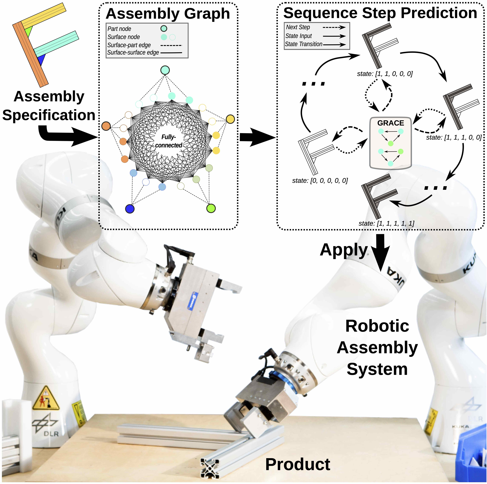
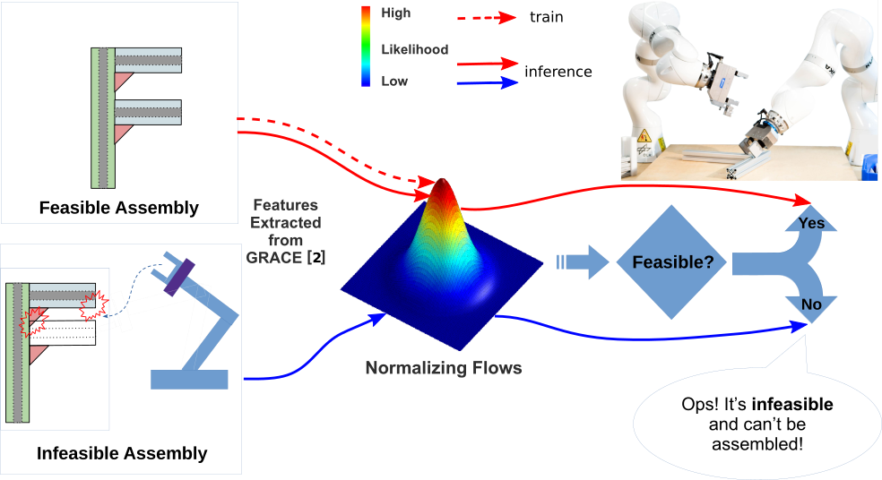

# GRACE: GRaph Assembly proCessing nEtworks

This is the repository for our two papers:
1. Atad, M.\*, Feng, J.\*, Rodríguez, I., Durner, M. and Triebel, R., 2023. Efficient and Feasible Robotic Assembly Sequence Planning via Graph Representation Learning. arXiv preprint arXiv:2303.10135. 
2. Feng, J.\*, Atad, M.\*, Rodríguez, I., Durner, M., Günnemann, S., and Triebel, R., 2023. Density-based Feasibility Learning with Normalizing Flows for Introspective Robotic Assembly. 

The [first](https://arxiv.org/abs/2303.10135) was accepted to IROS 2023 and the [second](https://arxiv.org/abs/2307.01317) to the [RSS 2023 Workshop on Assembly and AI](https://sites.google.com/nvidia.com/industrial-assembly/home).

\* Equal contributers

## Abstracts
### Efficient and Feasible Robotic Assembly Sequence Planning via Graph Representation Learning




Automatic Robotic Assembly Sequence Planning (RASP) can significantly improve productivity and resilience in modern manufacturing along with the growing need for greater product customization. One of the main challenges in realizing such automation resides in efficiently finding solutions from a growing number of potential sequences for increasingly complex assemblies. Besides, costly feasibility checks are always required for the robotic system. To address this, we propose a holistic graphical approach including a graph representation called Assembly Graph for product assemblies and a policy architecture, Graph Assembly Processing Network, dubbed GRACE for assembly sequence generation. Secondly, we use GRACE to extract meaningful information from the graph input and predict assembly sequences in a step-by-step manner. In experiments, we show that our approach can predict feasible assembly sequences across product variants of aluminum profiles based on data collected in simulation of a dual-armed robotic system. We further demonstrate that our method is capable of detecting infeasible assemblies, substantially alleviating the undesirable impacts from false predictions, and hence facilitating real-world deployment soon.

### Density-based Feasibility Learning with Normalizing Flows for Introspective Robotic Assembly




Machine Learning (ML) models in Robotic Assembly Sequence Planning (RASP) need to be introspective on the predicted solutions, i.e. whether they are feasible or not, to circumvent potential efficiency degradation. Previous works need both feasible and infeasible examples during training. However, the infeasible ones are hard to collect sufficiently when re-training is required for swift adaptation to new product variants. In this work, we propose a density-based feasibility learning method that requires only feasible examples. Concretely, we formulate the feasibility learning problem as Out-of-Distribution (OOD) detection with Normalizing Flows (NF), which are powerful generative models for estimating complex probability distributions. Empirically, the proposed method is demonstrated on robotic assembly use cases and outperforms other single-class baselines in detecting infeasible assemblies. We further investigate the internal working mechanism of our method and show that a large memory saving can be obtained based on an advanced variant of NF.

## Environment
1. Install the conda environemnt with:
```
conda env create --name grace --file=environment.yml
```

2. Download and extract the dataset and pretrained models from [here](https://drive.google.com/file/d/1RI4k5fYhZ_KkbKOJy_3HJ4vpoyAb0wxx/view?usp=sharing).

## Dataset
### Raw data
The raw dataset was created with the MedView simulation software and is stored in /data_raw. It includes specification files of each assembly parts, surfaces and their respective distances. In addition, assembly sequeneces are provided for feasible assemblies. Additional information is provided in the papers and the readme files in /data_raw..

### Processed data
We preprocess the raw assembly files and convert them to graph representations. We use two graph formats for this purpose:
1. Node Multiple Label (NML): each state in the assembly process is represented as a seperate graph instance. Each graph target property ('y') is a binary label per node where muliple nodes could be assigned with the '1' class. This graph format is used during the GRACE training step.
2. Graph Sequences (GSEQ): a single graph instance is used to represent the entire assembly process. The graph target ('y') is a list of possible assembly sequences.

For infeasible assemlbies, a signle NML graph is created in which the target of all part nodes is '0'. In GSEQ representation, infeasible assemblies are assgined with a 'dummy' target.

We provide processed data we used to trained and test our model in /data_processed.

### Create processed data
In order to create preprocessed dataset, used by the training and evaluation scripts, run the following:

```
python source/dataset.py --raw_data [dir] --dataset_path [output_dir] --mode [NML|GSEQ] [--nof_parts n]  --infeasible [exclude_all|convert_to_no_step] --split [trainval|test]
```

1. raw_dir: orignal dataset directory with assembly specifications.
2. dataset_path: output preprocessed dataset directory.
3. nof_parts: optional comma-seperated list of assembly sizes.
4. infeasible: either 'exclude_all' for feasbile assemblies only (defualt) or 'convert_to_no_step' for both feasbile and infeasible assemblies.
4. split: 'trainval' for training+validation split or 'test'

## Training and testing GRACE

Creates n random splits of the dataset, for each, trains a model and evaluates it. Saves plots of the results, inlcuding the average score.

```
python main.py --mode cross_validate --raw_dir [raw_files_dir] --assemblies_cache [raw_files_cache] --dataset_cache_root [fold_catch_dir]
```

raw_dir is the orignal dataset directory with assembly specifications.
In the first run, the raw files are processed and a graph pickle cache file is saved to raw_files_cache. An addtional fold_catch_dir is used to process files of each specific fold.

Additional important arguments:
1. train_nof_parts: list of assembly sizes to train
2. test_nof_parts: list of assembly sizes to test
3. test_mode : one of 'step', 'seq', 'p@k' or 'all' (default 'all'). More information in the paper.
4. skip_acc: skip fold if this accuracy wasn't reached on the validation set


## Training and testing the NF

```
python main.py --mode nf --ckpt pl_checkpoints/nml_5_trainval-epoch=32-val_acc=0.99.ckpt --dataset_path ../data_processed/gseq_5_nf_train/ --nf_val_set ../data_processed/gseq_5_nf_val/ --output_path pl_checkpoints/
```

ckpt is the pretrained GRACE network.
After 27 epoches this leads to AUC of 0.85 on validation set.


## Citation
If you find our work usefull, please consider citing it:
```
@article{atad2023efficient,
  title={Efficient and Feasible Robotic Assembly Sequence Planning via Graph Representation Learning},
  author={Atad, Matan and Feng, Jianxiang and Rodr{\'\i}guez, Ismael and Durner, Maximilian and Triebel, Rudolph},
  journal={arXiv preprint arXiv:2303.10135},
  year={2023}
}
```
```
@article{feng2023densitybased,
      title={Density-based Feasibility Learning with Normalizing Flows for Introspective Robotic Assembly}, 
      author={Jianxiang Feng and Matan Atad and Ismael Rodríguez and Maximilian Durner and Stephan Günnemann and Rudolph Triebel},
      journal={arXiv preprint arXiv:2307.01317},
      year={2023}
}
```
